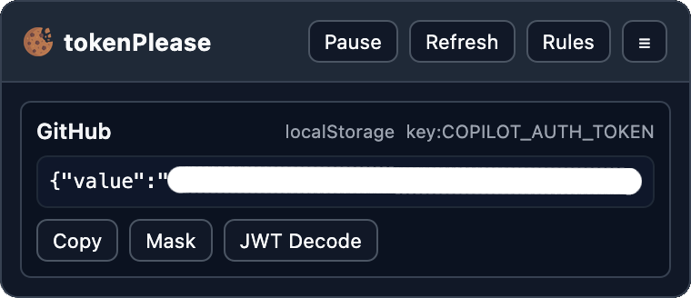

# tokenPlease

A browser extension that adds a permanent overlay on matched pages and displays values from `localStorage`, `sessionStorage`, or `cookies` with one-click copy.

## Features

- Configurable multi-rule engine (domain + source + key)
- Sources: `localStorage`, `sessionStorage`, `cookie`
- Cookie values read via background script (`cookies` API), including `HttpOnly`
- Domain matching for hostnames, root URLs, wildcard (`*.example.com`), and suffix patterns
- Regex key matching for all storage sources
- SPA-safe polling + history navigation refresh
- Collapsible, toggleable overlay UI
- Per-entry `JWT Decode` button with click-to-toggle payload preview
- Multi-menu options interface (Rules / Behavior / Import-Export)

## Getting Started

### Firefox

1. Rename `manifest.firefox.json` to `manifest.json` (or run: `cp manifest.firefox.json manifest.json`).
2. Open Firefox.
3. Go to `about:debugging#/runtime/this-firefox`.
4. Click **Load Temporary Add-on**.
5. Select `manifest.json` from this project folder.
6. Open the extension popup or go to **Rules & Settings** to add your first rule.

### Chromium (Chrome, Edge, Brave)

1. Rename `manifest.chrome.json` to `manifest.json` (or run: `cp manifest.chrome.json manifest.json`).
2. Open your browser extensions page (for Chrome: `chrome://extensions`).
3. Enable **Developer mode**.
4. Click **Load unpacked**.
5. Select this project folder.
6. Open popup/options and add your first rule.

## Browser Support

- Firefox
- Chromium-based browsers (Chrome, Edge, Brave)

## Usage

- Open any page under your configured domains.
- The overlay appears at top-right.
- Use **Copy** for instant clipboard copy.
- Use **Mask/Reveal** per entry.
- Use **JWT Decode** to toggle decoded payload preview for JWT values.
- Use **Rules** button in overlay (or popup) to open settings.

## Rule Fields

- **Name**: display label
- **Enabled**: toggle rule on/off
- **Source**: `localStorage` | `sessionStorage` | `cookie`
- **Domains**: one per line (hostname, full URL, or wildcard)
- **Key or regex pattern**: storage key / cookie name
- **Regex mode**: when enabled, pattern matches multiple keys

## Notes

- Content scripts run on pages and read `localStorage`/`sessionStorage` for that page origin.
- Cookie reads are delegated to background script.
- Overlay is only shown when at least one enabled rule matches the current URL.
- Default refresh interval is `5000ms` (configurable in settings).

## Manifest Files

- `manifest.firefox.json`: Firefox build
- `manifest.chrome.json`: Chromium build (Chrome, Edge, Brave)
